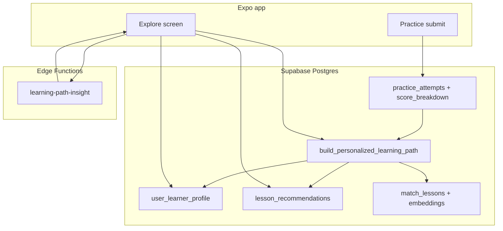

# Personalized Learning Path

This document explains how Touch That AI personalizes each learner’s path using **tracked behavior**, **RAG**, and **optional Gemini** coaching text.

---

## What you get (product features)

### 1. Your personalized path (Explore)

A new card **“Your personalized path”** shows:

- **Coach insight** — short explanation of why these lessons are next (Gemini when configured, otherwise a local summary).
- **Goal / level / average score** — derived from your practice history.
- **Weakest rubric area** — e.g. context, clarity (from `score_breakdown` on each attempt).
- **Weakest skill** — e.g. `prompting`, `safety` (from lesson metadata).
- **Refresh my path** — rebuilds recommendations from the latest data.

### 2. Your next steps (formerly “Recommended for you”)

An ordered list of **3–5 lessons** chosen by the backend, not random:

| Signal | What happens |
|--------|----------------|
| New user (0 attempts) | Starter path via **RAG** for your default goal |
| Review due (`review_due_at`) | Review lesson surfaced first |
| Last score &lt; 5/10 | **Repeat** that lesson |
| Last score ≥ 8/10 | **Next lesson** in the same module (if not already “mastered”) |
| Weak skill / criterion | **RAG** finds lessons you haven’t scored ≥ 80% on yet |
| Mastered lessons | Skipped (score ≥ 80 on that lesson) |

Tapping a step opens that **specific lesson** (deep link with `lessonId`).

### 3. Automatic updates after practice

When you submit practice:

1. Rule-based score runs on the device.
2. Attempt + `score_breakdown` saved to `practice_attempts`.
3. `user_progress` updated (existing trigger).
4. **`build_personalized_learning_path`** runs (replaces the old simple recommendation rule).

Returning to **Explore** refreshes the path card and next steps.

### 4. Find a lesson (manual RAG)

Still available: pick goal / level / skill and retrieve one lesson by semantic similarity (unchanged).

### 5. Gemini (optional)

| Feature | Edge Function | When |
|---------|---------------|------|
| Path coach text | `learning-path-insight` | Explore load / refresh |
| Practice tips | `enhance-feedback` | After each practice submit |
| Playground | `playground-complete` | Generate in playground |

All use **`GEMINI_API_KEY`** in Supabase secrets only.

---

## How it works (technical)



### Behavior analysis (`get_learner_behavior_summary`)

Reads the last practices with `score_breakdown` JSON and computes:

- Average per criterion (clarity, context, constraints, outputFormat, safety).
- **Weak criterion** — lowest average.
- **Weak skill** — skill with lowest average score across attempts.
- **Preferred goal** — most common `lessons.goal_key` you practiced.
- **Suggested level** — `intermediate` if avg ≥ 7.5/10, else `beginner`.

### Path builder (`build_personalized_learning_path`)

1. Runs behavior summary.
2. Upserts **`user_learner_profile`** (cache for the UI).
3. Clears and rebuilds **`lesson_recommendations`** with prioritized steps (review → repeat/advance → RAG gaps).
4. RAG uses `match_lessons(goal, level, weak_skill)` and excludes lessons you already scored ≥ 80 on.

`recompute_recommendations` now simply calls this function (so existing triggers keep working).

### Gemini insight (`learning-path-insight`)

The app sends the learner profile summary to the Edge Function. Gemini returns 2–3 friendly sentences. If the function fails, **`buildLocalPathInsight`** in the app shows a static explanation.

---

## Setup

### 1. Apply migration

In Supabase SQL Editor, run:

```
supabase/migrations/004_personalized_learning.sql
```

(After migrations `001`–`003` and `schema.sql` / `seed.sql`.)

### 2. Embeddings (for RAG steps)

```bash
pip install -r scripts/requirements-embeddings.txt
python scripts/embed_lessons.py
```

### 3. Deploy Edge Function (optional coach text)

```bash
supabase secrets set GEMINI_API_KEY=your-key
supabase functions deploy learning-path-insight
```

---

## Usage (Expo Go)

1. **Sign in** and open **Explore**.
2. Read **Your personalized path** (insight + stats).
3. Scroll to **Your next steps** — complete lessons in order.
4. After each **practice**, go back to Explore; path and steps should update.
5. Tap **Refresh my path** after several practices to force a rebuild.

---

## Testing

### App checks

| Test | Expected |
|------|----------|
| New account | Path card appears; next steps show 3 starter lessons; insight welcomes you |
| 1 practice, low score | Repeat or weak-skill lesson in next steps; weak criterion shown |
| 1 practice, high score (8+) | “Next in path” for following lesson in module |
| Return after 3+ days | Review line if `review_due_at` passed |
| Refresh my path | List order/reasons may change; loading state on button |

### SQL checks

```sql
-- Learner model
select * from user_learner_profile where user_id = '<uuid>';

-- Behavior JSON
select get_learner_behavior_summary('<uuid>');

-- Rebuild path manually
select build_personalized_learning_path('<uuid>');

-- Next steps
select lr.priority, lr.reason, l.title
from lesson_recommendations lr
join lessons l on l.id = lr.lesson_id
where lr.user_id = '<uuid>'
order by lr.priority;
```

### Verify RAG is used in path

```sql
select build_personalized_learning_path('<uuid>');
-- Then check reasons containing 'Personalized:' or 'Step'
```

---

## Data tracked for personalization

| Source | Fields used |
|--------|-------------|
| `practice_attempts` | `score`, `score_breakdown`, `lesson_id`, `completed_at` |
| `lessons` | `skill`, `goal_key`, `module_slug`, `sort_order`, `level` |
| `user_progress` | `mastery`, `review_due_at`, `last_practiced_at` |
| `lesson_embeddings` + `learning_profiles` | RAG similarity for gap-filling lessons |

---

## Keys and cost

| Component | API key? | Cost |
|-----------|----------|------|
| Behavior analysis | No | Free (Postgres) |
| Path builder + RAG | No | Free (pgvector + MiniLM embeddings precomputed) |
| Gemini insight | `GEMINI_API_KEY` (Supabase secret) | Your Gemini quota |
| App bundle | Only Supabase anon key | — |

There is **no embedding API key** at runtime.

---

## Files reference

| Area | Path |
|------|------|
| Migration | `supabase/migrations/004_personalized_learning.sql` |
| Edge Function | `supabase/functions/learning-path-insight/index.ts` |
| App service | `src/services/personalization.service.ts` |
| Hook | `src/features/personalization/hooks/usePersonalizedLearning.ts` |
| UI | `src/features/personalization/components/PersonalizedPathCard.tsx` |
| Explore integration | `src/features/lessons/screens/ExploreScreen.tsx` |

---

## Troubleshooting

| Issue | Fix |
|-------|-----|
| Empty path card | Run migration `004`; tap **Refresh my path** |
| Generic next steps only | Complete practice while signed in; check `practice_attempts.score_breakdown` is not null |
| No “Personalized:” reasons | Run `embed_lessons.py`; confirm `lesson_embeddings` count &gt; 0 |
| No Gemini insight | Deploy `learning-path-insight` + set `GEMINI_API_KEY`; local fallback still shows |
| SQL error on `goal_key` | Run migration `003` |

---

## Related docs

- [`supabase/MIGRATIONS.md`](../supabase/MIGRATIONS.md) — full migration order  
- [`supabase/TESTING.md`](../supabase/TESTING.md) — RAG and practice verification  
